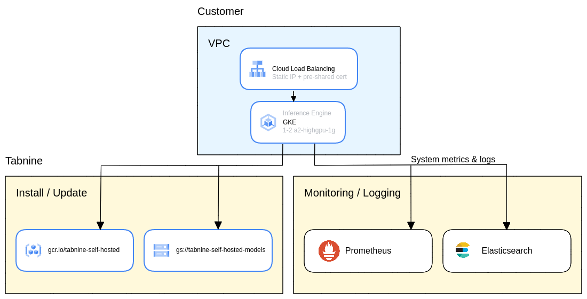

# terraform-google-gke-tabnine

This module creates a reslient and fault tolerant Tabnine installation using Google
Kubernetes Engine (GKE) as the computing environment.



## Prerequistes
- This module uses Nvidia A100 GPU make sure to select a [zone/region](https://cloud.google.com/compute/docs/gpus/gpu-regions-zones) where A100 is available.
- Terraform 1.2.7+
- Install [helm](https://helm.sh/)
- Install [helm-gcs](https://github.com/hayorov/helm-gcs)
- Add Tabnine helm charts repository __make sure you have read acccess to__ `gs://tabnine-self-hosted-helm-charts` 
  ```bash
  helm repo add tabnine gs://tabnine-self-hosted-helm-charts
  ```

- Add fluent helm charts repository
  ```bash
  helm repo add fluent https://fluent.github.io/helm-charts
  ```

- Add Prometheus helm charts repository
  ```bash
  helm repo add prometheus-community https://prometheus-community.github.io/helm-charts
  ```

- Configure `gcloud` to use the right project:

  ```bash
  gcloud config set project <PROJECT ID>
  ```

- Make sure that GKE is enabled for the `<PROJECT ID>` you are going to use.

  ```bash
  gcloud services enable container.googleapis.com
  ```
  
- Log in with a user that has `Editor` & `Project IAM Admin` roles.

## Usage

There are examples included in the [examples](./examples/) folder but simple usage is as follows:

```hcl
module "gke_tabnine" {
  source                     = "github.com/codota/terraform-google-gke-tabnine"
  project_id                 = "<PROJECT ID>"
  region                     = "<REGION>"
  zones                      = ["<ZONE-1>", "<ZONE-2>"]
  create_vpc                 = true
  create_service_account     = true
}

```

<!-- BEGIN_TF_DOCS -->
## Inputs

| Name | Description | Type | Default | Required |
|------|-------------|------|---------|:--------:|
| <a name="input_create_service_account"></a> [create\_service\_account](#input\_create\_service\_account) | Should create a service\_account, or used the one provided by `service_account_email` | `bool` | `false` | no |
| <a name="input_create_tabnine_storage_bucket_im_bindings"></a> [create\_tabnine\_storage\_bucket\_im\_bindings](#input\_create\_tabnine\_storage\_bucket\_im\_bindings) | Create Tabnine storage bucket im bindings. Should be set to true only when run by Tabnine team | `bool` | `false` | no |
| <a name="input_create_vpc"></a> [create\_vpc](#input\_create\_vpc) | Should create a VPC, or used the one provided by `network_name` | `bool` | `false` | no |
| <a name="input_customer_id"></a> [customer\_id](#input\_customer\_id) | Customer ID | `string` | n/a | yes |
| <a name="input_es_private_key"></a> [es\_private\_key](#input\_es\_private\_key) | n/a | `string` | n/a | yes |
| <a name="input_exclude_nvidia_driver"></a> [exclude\_nvidia\_driver](#input\_exclude\_nvidia\_driver) | Should exclude nvidia driver from installation | `bool` | `false` | no |
| <a name="input_ingress"></a> [ingress](#input\_ingress) | Configuration of inference engine | <pre>object({<br>    host     = string,<br>    internal = bool<br>  })</pre> | <pre>{<br>  "host": "",<br>  "internal": true<br>}</pre> | no |
| <a name="input_ip_range_pods"></a> [ip\_range\_pods](#input\_ip\_range\_pods) | Pods ip range, used when `create_vpc` is set to `false` | `string` | `""` | no |
| <a name="input_ip_range_services"></a> [ip\_range\_services](#input\_ip\_range\_services) | Services ip range, used when `create_vpc` is set to `false` | `string` | `""` | no |
| <a name="input_network_name"></a> [network\_name](#input\_network\_name) | VPC name, used when `create_vpc` is set to `false` | `string` | `""` | no |
| <a name="input_prefix"></a> [prefix](#input\_prefix) | Prefix all resources names | `string` | `"tabnine-self-hosted"` | no |
| <a name="input_project_id"></a> [project\_id](#input\_project\_id) | GCP project ID | `string` | n/a | yes |
| <a name="input_region"></a> [region](#input\_region) | GCP region | `string` | n/a | yes |
| <a name="input_service_account_email"></a> [service\_account\_email](#input\_service\_account\_email) | Service account email, used when `create_service_account` is set to `false` | `string` | `""` | no |
| <a name="input_subnetwork"></a> [subnetwork](#input\_subnetwork) | VPC subnetwork name, used when `create_vpc` is set to `false` | `string` | `""` | no |
| <a name="input_subnetwork_proxy_only"></a> [subnetwork\_proxy\_only](#input\_subnetwork\_proxy\_only) | VPC subnetwork proxy only name, used when `create_vpc` is set to `false` | `string` | `""` | no |
| <a name="input_zones"></a> [zones](#input\_zones) | GCP zones | `list(string)` | n/a | yes |

## Outputs

| Name | Description |
|------|-------------|
| <a name="output_ingress_ip"></a> [ingress\_ip](#output\_ingress\_ip) | Static IP of inference engine ingress |
<!-- END_TF_DOCS -->


## On first use

- `terraform init` to get the plugins
- `tf apply -target module.gke_tabnine.module.service_accounts
 ` to create the service account first  
- `tf apply -var exclude_nvidia_driver=true`
   to create infrastructure without nvidia drivers, this is a hack since kubernetes_manfest requires a live kubernetes cluster. (see https://registry.terraform.io/providers/hashicorp/kubernetes/latest/docs/resources/manifest#before-you-use-this-resource)
   can be solved later by migrating to `kubernetes_daemonset`
- `terraform apply` to apply everything
